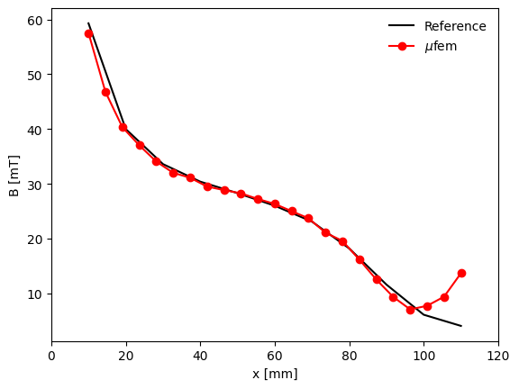

# Compumag Team 13: 3D Nonlinear Magnetostatic

## Introduction

The problem[1] is a non linear magnetostatic case with an exciting coil set between two steel channels, and
a steel plate inserted between the channels. The applied coil current is is large enough to saturate the steel.
The goal is to calculate the magnetic flux density at certain points.

<em>Geometry of the benchmark. An excitation coil surounded by thin steel plate. Due to symmetry only half the model is modeleld..</em>

  

The problem exhibits a strong nonlinearity due to the bh curve used in the channels and center plate with a Rayleigh region and saturation:

| BH Curve | Zoomed-om Rayleigh region |
| -------- | --------- |
|  |  |

## Setup

We use second order accuracy.

## Results

* **Magnetic Flux Density in the Air**

  

## References

[1] https://www.compumag.org/wp/wp-content/uploads/2018/06/problem13.pdf

[2] Nakata, T., Takahashi, N. and Fujiwara, K., 1995. Summary of results for TEAM workshop problem 13 (3‐D nonlinear magnetostatic model). COMPEL-The international journal for computation and mathematics in electrical and electronic engineering, 14(2/3), pp.91-101.

[3] Nakata, T. and Fujiwara, K., 1992. Summary of results for benchmark problem 13 (3‐d nonlinear magnetostatic model). COMPEL-The international journal for computation and mathematics in electrical and electronic engineering, 11(3), pp.345-369.
