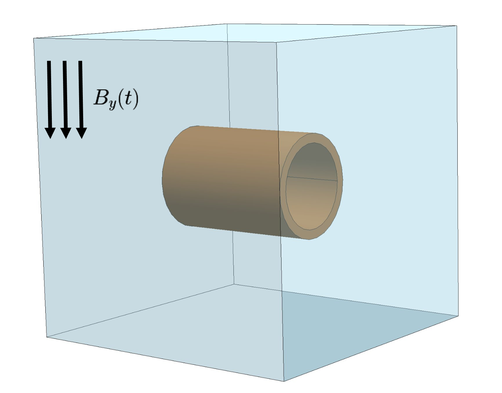
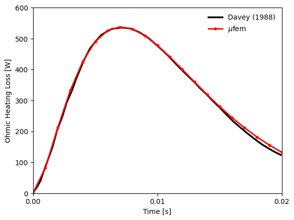
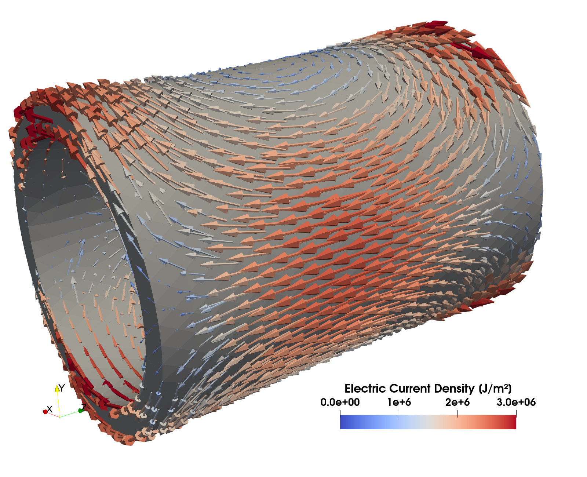

# Compumag TEAM 1b: The Felix Short Cylinder

## Introduction

The *TEAM-1b: Felix Short cylinder* test case is a part of *Compumag TEAM's benchmark suite* [[1]](#CompumagCase)  and has played a significant role in evaluating the accuracy of electromagnetic programs to predict the evolution of eddy currents.
It dates back to the Argonne National Labs of the FELIX (Fusion ELectromagnetic Induction eXperiment) efforts.

The goal of the benchmark is to measure the circulating eddy currents over time, the Ohmic losses, and the stored magnetic energy.
Here, we only focus on the Ohmic losses.

<div align="center">
    
    <br/>
    <br/>
    <em>Figure 1: The geometry of the setup.</em>
</div>
<br/>


## Setup

The setup is a conductive aluminum cylinder with a homogeneous magnetic field in y-direction which decreases exponentially over time according to
```math
B_y(t) = B_0 e^{-t/\tau} \quad,
```
where $t=0$ represents the initial time where the magnetic field fully penetrates the cylinder. The decay constant is $\tau=0.0069$ and initial magnetic flux density is $B_0 = 0.1 \left[T \right]$. The decaying external magnetic flux density field can be incorporated into our solution by imposing at outer boundary a time-varying magnetic field of the form
```math
\mathbf{H}(t) =
\left(
    \begin{array}{c}
    0 \\
    \mu_0 B_y(t) \\
     0
        \end{array}
\right) \quad.
```

The changing magnetic field induces eddy currents in the cylinder. Part of the benchmark is to calculate the *Ohmic losses* which can be calculated by
```math
   \rho_\Omega
   \left[ \frac{\rm{W}}{\rm{m}^3} \right]
   = \vec{J} \cdot \vec{E} = \sigma \frac{\partial \vec{A}}{\partial t} \cdot \frac{\partial \vec{A}}{\partial t} \quad.
```
The resistivity of the aluminum is $\rho = \sigma^{-1} = 3.94 \times 10^{-8} \left[\frac{\rm{\Omega}}{\rm{m}} \right]$.

We setup an unsteady simulation with the [Time-Domain Magnetic Model](https://raiden-numerics.github.io/mufem-doc/models/electromagnetics/time_domain_magnetic/time_domain_magnetic_model). A *Magnetostatic initialization* is used to model the initial penetration of the magnetic field in the conductive cylinder. The [Tangential Magnetic Field](https://raiden-numerics.github.io/mufem-doc/models/electromagnetics/time_domain_magnetic/conditions/tangential_magnetic_field_condition) condition is used to impose the magnetic field.

## Results

The quantity of interest is the *Ohmic Heating Loss* inside the cylinder over time. The reference results can be found [Davey (1988)](#Davey1988)



We see that the _Ohmic heating losses_ are well reproduced by the code with only minor deviations towards the end.

At the final time step the "Electric Current Density" field is exported and visualized using ParaView using the [create_scene.py](create_scene.py) script.

<div align="center">
    
    <br/>
    <br/>
    Figure 2: Eddy currents inside the cylinder at the final time.
</div>
<br/>


## References

<a id="CompumagCase"></a> [1] Compumag, https://www.compumag.org/wp/wp-content/uploads/2018/06/problem1b.pdf, "Problem 1B The FELIX short Cylinder Experiment"

<a id="Davey1988"></a> [2] Davey, K., "The Felix Cylinder Problem (International Eddy Current Workshop Problem 1)."
    COMPEL-The international journal for computation and mathematics in electrical and electronic engineering
    7.1/2 (1988): 11-27. doi: 10.1108/eb010036
