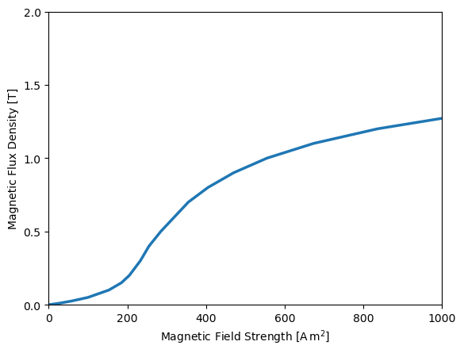

# Compumag Team-20: 3D Static Force Problem

## Introduction

The *Compumag Team 20 problem*[1] is a non-linear magnetostatic case to validate the force generated on a pole.
The problem exhibits strong nonlinearity, which requires a robust solver.

<div align="center">

</div>
<div align="center">
<em>Geometry of the benchmark. An excitation coil surrounds a pole and a yoke.</em>
</div>
<br /><br />


The *Yoke* and *Pole* are iron materials with a BH curve with a Rayleigh region and saturation.

| BH Curve | BH Curve (zoomed) |
| --- | --- |
|  |  |
| | The BH curve has a strong Rayleigh region. |


The excitation coil is a wound (stranded) coil with 1000 turns. We measure the force acting on the pole for different coil currents ranging
from $I=0\text{A}$ to $I=5\text{A}$ (in total 11 measurements).


We run [case.py](case.py) inside bash with
```bash
> tput reset; ~/mufem/Release/mufem/pymufem.sh case.py 
...
43 2.477455e-08
44 7.077223e-10
45 3.873954e-11
Stopping criterion reached!
electromagnetic.TimeDomainMagneticModel, 
46 2.857851e-06
47 1.633936e-07
48 1.051301e-08
49 1.973070e-10
50 4.131711e-11
Stopping criterion reached!
electromagnetic.TimeDomainMagneticModel, 
51 2.642555e-06
52 1.691569e-07
53 1.072489e-08
54 3.637672e-10
55 4.148898e-11
Stopping criterion reached!
```

The script [case.py](case.py) stores the force created for each assigned coil current and generates a plot showing the dependency of the
force vs. the coil current:


  
We find a good match to the experimental and numerical values reported in [2] and [3].

## References

[1] https://www.compumag.org/wp/wp-content/uploads/2018/06/problem20.pdf

[2] Takahashi, N., T. Nakata, and H. Morishige. "Summary of results for problem 20 (3‐D static force problem)." COMPEL-The international journal for computation and mathematics in electrical and electronic engineering 14.2/3 (1995): 57-75. doi: doi.org/10.1108/eb010138

[3] Takahashi, Norio, Takayoshi Nakata, and H. Morishige. "Investigation of a model to verify software for 3-D static force calculation." IEEE transactions on magnetics 30.5 (1994): 3483-3486. doi: doi.org/10.1109/20.312689