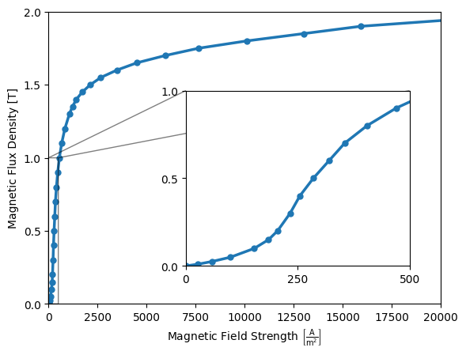

# Compumag Team-20: 3D Static Force Problem

## Introduction

The problem [1] is a non-linear magnetostatic case with a center pole and yoke made of ferromagnetic steel, and a stranded (wound) copper coil which is excited by a constant current. The geometry is shown in Figure 1.


<div align="center">

</div>
<div align="center">
    <br/>Figure 1: Geometry of the benchmark. An excitation coil surrounds a steel pole and yoke. Due to symmetry only 1/4th model is modelled.
</div>
<br /><br />

When current is flowing through the coil, a magnetic field is generated which is channeled through the ferromagnetic material. This creates a force between the pole and the yoke which is measured. We are interested the relation between the coil current and the resulting force on the pole. The force on the center pole is compared to **experimental values** presented in [[3]](#[3]).

## Setup


### Mesh

The mesh was created using netgen and saved in the [mfem v13 format](https://mfem.org/mesh-format-v1.0/#mfem-mesh-v13) using named attributes for the volume bodies (Coil, Air, Center and Coil) and boundaries.

<div align="center">

</div>
<div align="center">
Figure 2: The mesh used in the simulation visualized using <a href="https://glvis.org/">glvis</a>. While the mesh in the air body can be coarse, the yoke and pole require a finer mesh to ensure a good accuracy.</div>
</div>
<br /><br />

### Model

We use the [Time-Domain Magnetic Model](https://www.raiden-numerics.com/mufem/models/electromagnetics/time_domain_magnetic/time_domain_magnetic_model.html) which solves for the magnetic field using finite-element discretization and following equation:
```math
\rm{curl}\, \mu^{-1} \rm{curl}\, \mathbf{A} = \mathbf{J} \quad,
```
where $\mathbf{A} [\frac{\rm{Wb}}{\rm{m}}]$ is the magnetic vector potential, $\mu [\frac{\rm{H}}{\rm{m}}]$ is the magnetic permeability, and $\mathbf{J} [\frac{\rm{A}}{\rm{m}^2}]$ is the electric current density. The magnetic flux density $\mathbf{B} [T]$ is then given by $\mathbf{B} = \rm{curl} \mathbf{A}$. The magnetic field $\mathbf{H}[\frac{\rm{A}}{\rm{m}}]$ can be obtained from $\mathbf{H} = \mu^{-1} \mathbf{B}$. Note that the electric current denisty is only non-zero in the coil body and is required to be divergence free, i.e., $\nabla \cdot \mathbf{J} = 0$.

As for the boundary, by symmetry the magnetic flux needs to be tangential to the symmetry faces; thus we assign a [Tangential Magnetic Flux Condition](https://www.raiden-numerics.com/mufem/models/electromagnetics/time_domain_magnetic/conditions/tangential_magnetic_flux_boundary_condition.html) which ensures that $\mathbf{B} \cdot \mathbf{n} = 0$. This is achieved by specifiying the tangential components of $\mathbf{A}$ to zero, i.e. $\mathbf{n} \times \mathbf{A} = 0$. While the air boundary, as a far field boundary can be choosen to be either left free, for simplicity we assign a tangential flux condition to it as well.

### Excitation

The electric current density in the right-hand side of the equation is provided by the [Excitation Coil Model](https://www.raiden-numerics.com/mufem/models/electromagnetics/excitation_coil/excitation_coil_model.html) which models the poperties of the stranded coil. The electric current density inside the coil body can be calculated using
```math
\mathbf{J}= I \frac{n_t}{S_c} \mathbf{d} \quad,
```
where $I [\rm{A}]$ is the applied coil current, $n_t$ is the number of coil turns, and $S_c[\rm{m}^2]$ is the coil cross section and $\mathbf{d}$ is the coil path (please note that the actual calculation is more involved as we need to ensure that the electric current density is homogeneous along a coil cross section as well as support non-constant cross sections of the coil geometry). Here, we choose $n_t=1000$ and a coil current ranging from $I=0\text{A}$ to $I=5\text{A}$ with a total 11 measurements.

### Reports

The force is calculated using the [Magnetic Force Report](https://www.raiden-numerics.com/mufem/models/electromagnetics/time_domain_magnetic/reports/magnetic_force_report.html) which uses the Maxwell stress tensor $\mathbb{T} [\rm{Pa}]$ given by
```math
\mathbb{T} = \mathbf{B} \otimes \mathbf{H} - \frac{1}{2} \left( \mathbf{B} \cdot \mathbf{H} \right) \mathbb{I}   \quad.
```
The force $\mathbf{F}[\rm{N}]$ is then given by integrating over the surface $S$ of the center pole body with
```math
\mathbf{F} = \int_S \mathbb{T} \cdot \mathbf{n} \,\rm{d}S \quad,
```
where $\mathbf{n}$ is the normal along the surface. Note that only the z-component of $\mathbf{F}$ is relevant for the benchmark here.


### Materials

While the *coil* and *air* have vacuum permeability, the *Yoke* and *Pole* are iron materials with a strong non-linearity given by the B(H) curve with a Rayleigh region and saturation. Robustly capturing the Rayleigh region and saturation effects is numerically challenging. In the benchmark case, the [bh-curve](data/Table_1_BH_Curve.csv) in tabulated is used, also shown in Figure 2.

<div style="display: flex; align-items: flex-start;">
    
    <div>
        <p><em>Figure 2: The BH curve used in the problem.</em></p>
        <p>
            The BH curve shown represents the magnetic response of the ferromagnetic material. It exhibits two important regions:
        </p>
        <ul>
            <li>
                <strong>Rayleigh Region:</strong> The low-field regime (highlighted in the inset) where the magnetization increases quadratically with the applied field. This behavior is governed by the Rayleigh Law, attributed to domain wall motion and small reversible displacements.
            </li>
            <li>
                <strong>Saturation Region:</strong> At high fields, most magnetic domains align with the applied field, causing the curve to flatten as the material approaches saturation magnetization.
            </li>
        </ul>
        <p>
            The transition between these regions is characterized by the irreversible domain wall movements and progressive domain rotation.
        </p>
    </div>
</div>


## Running the case


We run the case using [case.py](case.py) with
```bash
> pymufem case.py
...
43 2.477455e-08
44 7.077223e-10
45 3.873954e-11
Stopping criterion reached!
electromagnetic.TimeDomainMagneticModel,
46 2.857851e-06
47 1.633936e-07
48 1.051301e-08
49 1.973070e-10
50 4.131711e-11
Stopping criterion reached!
electromagnetic.TimeDomainMagneticModel,
51 2.642555e-06
52 1.691569e-07
53 1.072489e-08
54 3.637672e-10
55 4.148898e-11
Stopping criterion reached!
```

Note that in [case.py](case.py), we have a loop over an increasing value of the coil current:
```python
for coil_current in numpy.linspace(0.0, 5.0, 11):

    coil_drive_current.set_value(coil_current)
    steady_runner.advance(5)

    force_z = magnetic_force_report_1.evaluate().z

    center_piece_force_list.append((coil_current, force_z))
```
Which sets the current, runs the simulation and stores the resulting force. Finally, we generate a plot showing the dependency of the force versus the coil current.

<div align="center">

</div>
<div align="center">
<em>Figure 3: The resulting force in relation to the applied coil current and compared with the experimental values obtained from [2].</em>
</div>
<br /><br />


The results are presented in Figure 3, where we find a good match to the experimental and numerical values reported in [[2]](#[2]) and [[3]](#[3]). Note that initially the force increases quadratically with an increase of current until around $I=3A$, where the steel saturates.

Finally, we save the fields at $I=5A$ for further evaluation with [paraview](https://www.paraview.org/).

<div align="center">

</div>
<div align="center">
<em>Figure 4: The magnetic flux density at I=5 A. At the corner of the center pole the magnitude of the magnetic flux density exceeds the values of the provided bh table requiring extrapolation.</em>
</div>
<br /><br />

As an outlook, the paper [[3]](#[3]) suggests to investigate the effect of model order, and adaptive refinement (among others) which we will look into in an upcoming update.


## References

<a id="[1]"></a> [1] https://www.compumag.org/wp/wp-content/uploads/2018/06/problem20.pdf

<a id="[2]"></a> [2] N. Takahashi, T. Nakata, and H. Morishige. "Summary of results for problem 20 (3‐D static force problem)." COMPEL-The international journal for computation and mathematics in electrical and electronic engineering 14.2/3 (1995): 57-75. doi.org/10.1108/eb010138

<a id="[3]"></a> [3] N. Takahashi, N. Takayoshi, and H. Morishige. "Investigation of a model to verify software for 3-D static force calculation." IEEE transactions on magnetics 30.5 (1994): 3483-3486. doi.org/10.1109/20.312689