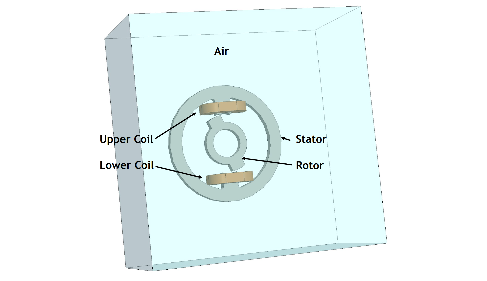
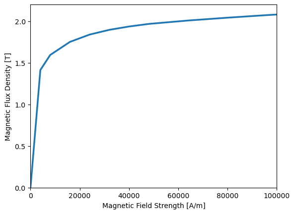
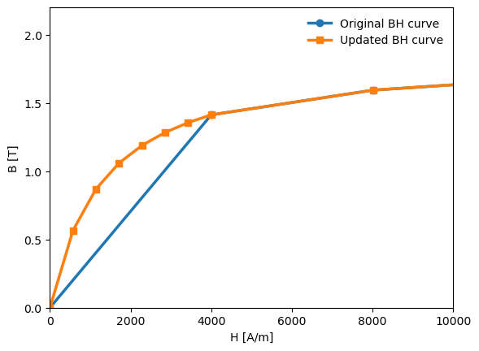
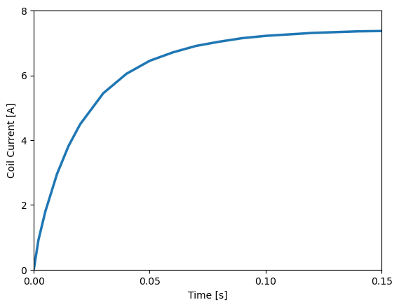
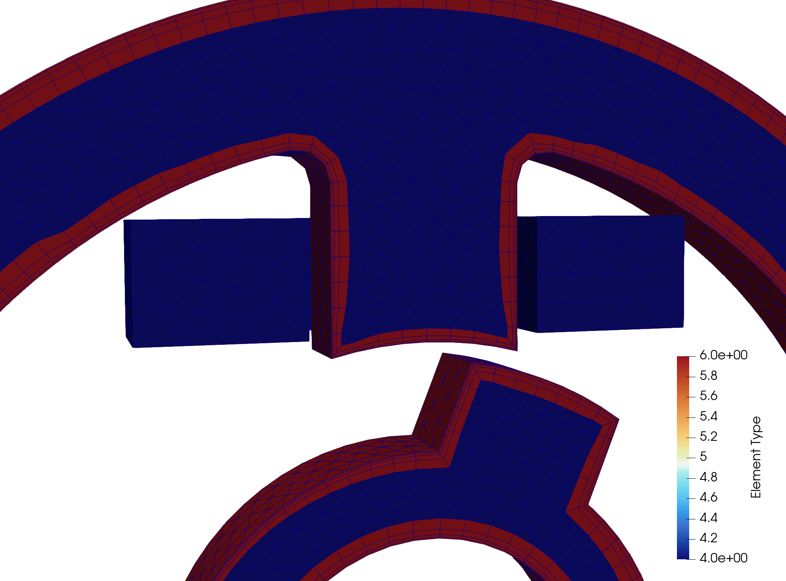
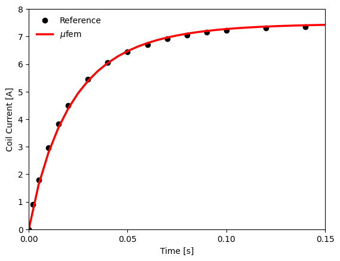
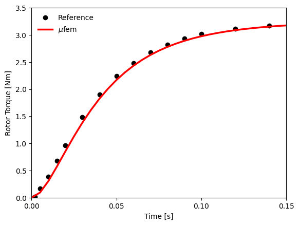
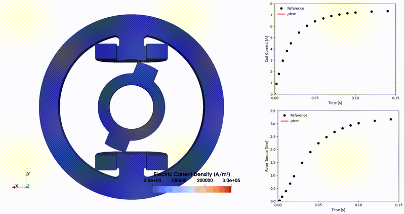

# Compumag TEAM-24: Nonlinear Time-Transient Rotational Test Rig

This benchmark case [1] is a transient magnetic problem involving eddy currents and nonlinear materials, solved using [case.py](case.py). The geometry is shown below:

<div align="center">
    
    <br/>
    <em>Figure 1: The geometry consists of a rotor locked at 22°, a stator, and two coils surrounded by an air domain.</em>
</div>
<br/>

The [mesh](geometry.mesh) was created using Netgen and exported in MFEM v1.3 format.

The goal of the benchmark is to calculate the torque acting on the rotor.

## Setup

### Updating the B-H Curve

The *rotor* and *stator* are made of iron with a constant electrical conductivity of
$\sigma = 4.54 \times 10^6 \, \mathrm{S/m}$ and a nonlinear permeability described by a B-H curve.

However, as pointed out in [2], the provided [B-H curve](data/tables/Table_1_BH_curve.csv) lacks sufficient data near zero, leading to significant errors. To address this, a modified Fröhlich formula is used to fit the data, ensuring physical behavior [3]:

$$
B(H) = \frac{1}{a + b H} + \mu_0 H \quad,
$$

where $a$ and $b$ are fitting parameters. These parameters are computed from the full curve and used to interpolate its initial segment.

| [Original B-H Curve](data/tables/Table_1_BH_curve.csv) | [Modified B-H Curve](data/tables/Updated_BH_curve.csv) |
| ----------------- | ------------------------------- |
|  |  |


### Setting the Coils

A constant electric voltage of $U=23.1 \, \mathrm{V}$ is applied to the stranded coils.

We specify a stranded coil by using the [Stranded Coil](https://raiden-numerics.github.io/mufem-doc/models/electromagnetics/excitation_coil/specs/type_stranded_coil/) option, and the voltage excitation is set by using
[Excitation Voltage](https://raiden-numerics.github.io/mufem-doc/models/electromagnetics/excitation_coil/specs/excitation_voltage) option.

```python
for coil in ["Upper", "Lower"]:

    coil_topology = CoilTopologyOpen(
        in_marker=f"{coil} Coil::In" @ Bnd, out_marker=f"{coil} Coil::Out" @ Bnd
    )

    # 0.25 factor as we have two coils to which the voltage is applied and we have a symmetry plane
    symmetry = 0.25

    coil_type = CoilTypeStranded(number_of_turns=350)

    coil_excitation = CoilExcitationVoltage.Constant(
        voltage=23.1 * symmetry, resistance=3.09 * symmetry
    )

    coil = CoilSpecification(
        name=f"{coil} Coil",
        marker=f"{coil} Coil" @ Vol,
        topology=coil_topology,
        type=coil_type,
        excitation=coil_excitation,
    )
    coil_model.add_coil_specification(coil)
```


This results in a current rise, compared against the [reference](data/tables/Table_3_Coil_Current.csv):

<div align="center">
    
    <br/>
    <em>Figure 3: Measured coil current rise under a constant applied voltage.</em>
</div>
<br/>

### Skin-Depth Layered Mesh

As the iron is conductive, eddy currents occur in the stator and rotor. To resolve them accurately, a mesh with a *prismatic boundary layer* is used.

For time-harmonic problems, the skin depth can be estimated by:

$$
\delta_s = \sqrt{\frac{2}{\omega \mu \sigma}},
$$

where $\omega = 2\pi f$ and $f$ is the excitation frequency. In time-transient problems, there is no single frequency; instead, the behavior is governed by the excitation time scale (e.g., rise time $\tau$).

For a linear setup with a single coil and no eddy currents, the current evolution is:

$$
I(t) = \frac{V}{R} \left( 1 - e^{-t/\tau} \right),
$$

with $\tau = L/R$, where $L$ is inductance and $R$ resistance.

These values are estimated using the [Magnetic Inductance Report](https://raiden-numerics.github.io/mufem-doc/models/electromagnetics/excitation_coil/reports/magnetic_inductance_report)
and the [Coil Resistance Report](https://raiden-numerics.github.io/mufem-doc/models/electromagnetics/excitation_coil/reports/coil_resistance_report) via:

```python
sim.initialize()

inductance_report = MagneticInductanceReport("Coil Inductance")
print("Inductance Value:\n", inductance_report.evaluate())

resistance_report = ResistanceReport("Coil Resistance")
print("Resistance Value:\n", resistance_report.evaluate())
```

Result:
```bash
>>> Inductance Value:
    [0.0117051, 0.00197861]
    [0.00197861, 0.0117273]

>>> Resistance Value:
    0.5145621732484141
```

Thus, $\tau \approx 0.01 / 0.5 = 0.02 \ \mathrm{s}$. Note that this is a rough estimate due to nonlinearity and eddy currents.

The eddy current penetration depth follows a diffusion law:
$$
\delta = \sqrt{D \tau} \quad, \quad \text{with} \quad D = \frac{1}{\mu \sigma} \quad.
$$

<div align="center">
    
    <br/>
    <em>Figure 4: Prismatic boundary layer elements (type 6) are used to capture skin effects. The interior uses tetrahedral elements (type 4).</em>
</div>
<br/>

### Torque Calculation

The [Magnetic Torque Report](https://raiden-numerics.github.io/mufem-doc/models/electromagnetics/time_domain_magnetic/reports/magnetic_torque_report) is used to compute the magnetic torque on the locked rotor over time, which is then compared to the reference.

## Results

After installing `mufem`, run the simulation using:

```bash
> pymufem case.py
...
Simulation done. Thank you for using the software.
```

The script [case.py](case.py) contains post-processing routines that extract *coil current vs. time* and *torque vs. time*:

<div align="center">
    
    <br/>
    <em>Figure 5: The simulated coil current closely matches the reference.</em>
</div>
<br/>

<div align="center">
    
    <br/>
    <em>Figure 6: The rotor torque shows good agreement with the reference.</em>
</div>
<br/>

To generate the animation, ensure `output_for_animation = True` is set in `case.py`. Then run the simulation followed by `paraview_gif.py` (requires `ffmpeg`). This produces the animation:

<div align="center">
    
    <br/>
    <em>Figure 7: Animation of the electric current density over time.</em>
</div>
<br/>

## References

[1] https://www.compumag.org/wp/wp-content/uploads/2018/06/problem24.pdf

[2] Rüberg, T., Kielhorn, L., & Zechner, J. (2021). Electromagnetic devices with moving parts—simulation with FEM/BEM coupling. *Mathematics, 9*(15), 1804.

[3] Diez, P., & Webb, J. P. (2015). A Rational Approach to \( B \)–\( H \) Curve Representation. *IEEE Transactions on Magnetics, 52*(3), 1-4.
