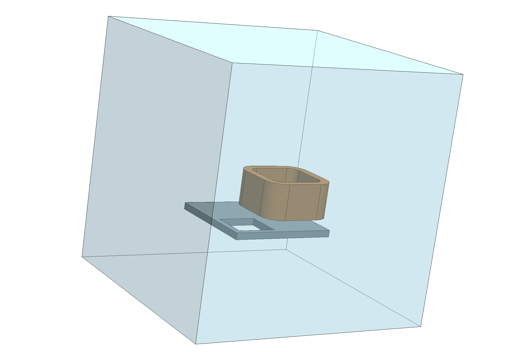

# Compumag TEAM Problem 7: Asymmetrical Conductor with a Hole

## Introduction

In the Compumag TEAM Problem 7 [1], a thick aluminum plate with a hole is placed below an excitation
coil carrying a sinusoidal current. The time-varying magnetic field induces eddy currents inside
the plate. The magnetic flux density measured above the plate is compared with experimental
results reported by Fujiwara et al. [2].

<div align="center">

</div>
<div align="center">
<em>Figure 1: Geometry of the benchmark. A coil is placed above an aluminium plate with a hole.</em>
</div>


## Problem Description

The aluminum plate has an electrical conductivity of $\sigma = 3.526 \times 10^7\,\mathrm{S/m}$.
The stranded coil is excited by a sinusoidal current corresponding to $2742\rm{AT}$ at a frequency
of $f=50\rm{Hz}$ (reference results at $200\rm{Hz}$ are also available).
The numerical results are compared with measurements of the magnetic flux density along two
lines on top of the plate, denoted A1–B1 and A2–B2.


## Setup

Since the problem is linear and the excitation is sinusoidal, the
[Time-Harmonic Magnetic Model](https://raiden-numerics.github.io/mufem-doc/models/electromagnetics/time_harmonic_magnetic/time_harmonic_magnetic_model)
can beused. The excitation is prescribed using the
[Excitation Coil Model](https://raiden-numerics.github.io/mufem-doc/models/electromagnetics/excitation_coil/excitation_coil_model).

The setup script is provided in [here](case.py) and the corresponding mesh can be found [here](geometry.mesh). The mesh contains three
[named attributes](https://mfem.org/mesh-format-v1.0/#mfem-mesh-v13): **Air**, **Coil**, and **Plate**.

### Model

To compensate for the relatively coarse mesh, a third-order spatial discretization is employed
in the time-harmonic magnetic model:

```python
magnetic_model = TimeHarmonicMagneticModel(
    Vol.Everywhere,
    frequency=50,
    order=3,
)
```

### Materials

Three
[materials](https://raiden-numerics.github.io/mufem-doc/models/electromagnetics/time_harmonic_magnetic/materials/time_harmonic_magnetic_material)
are defined: *air*, *copper*, and *aluminium*. Only aluminium is electrically conductive and
therefore supports eddy currents.

```python
air_material = TimeHarmonicMagneticGeneralMaterial.Constant(
    name="Air",
    marker="Air" @ Vol,
)

copper_material = TimeHarmonicMagneticGeneralMaterial.Constant(
    name="Copper",
    marker="Coil" @ Vol,
)

alu_material = TimeHarmonicMagneticGeneralMaterial.Constant(
    name="Alu",
    marker="Plate" @ Vol,
    relative_magnetic_permeability=1.0,
    electric_conductivity=3.526e7,
)
```


### Coil Excitation

The
[Excitation Coil Model](https://raiden-numerics.github.io/mufem-doc/models/electromagnetics/excitation_coil/excitation_coil_model)
is added to the simulation. The coil is modeled as

- a [current excitation](https://raiden-numerics.github.io/mufem-doc/models/electromagnetics/excitation_coil/specs/excitation_current) with \(I = 1\,\mathrm{A}\),
- a [stranded coil type](https://raiden-numerics.github.io/mufem-doc/models/electromagnetics/excitation_coil/specs/stranded_coil) with 2742 turns,
- a [closed coil topology](https://raiden-numerics.github.io/mufem-doc/models/electromagnetics/excitation_coil/specs/closed_coil).


```python
coil_model = ExcitationCoilModel()
sim.get_model_manager().add_model(coil_model)

coil_topology = CoilTopologyClosed(
    x=0.2, y=0.01, z=0.07,
    dx=1.0, dy=0.0, dz=0.0,
)

coil_type = CoilTypeStranded(number_of_turns=2742)

coil_excitation = CoilExcitationCurrent.Harmonic(
    magnitude=1.0,
    phase=0.0,
)

coil = CoilSpecification(
    name="Coil",
    marker="Coil" @ Vol,
    topology=coil_topology,
    type=coil_type,
    excitation=coil_excitation,
)
```


## Results

After running the simulation with `pymufem`, the following results are obtained in the
`results` directory.

### Magnetic Flux Density

The computed magnetic flux density is compared with the reference data from [2]. The reference
provides real and imaginary components of the magnetic flux density, corresponding to
measurements at

- $t = 0\,\mathrm{ms}$ (phase $\phi = 0^\circ$),
- $t = 5\,\mathrm{ms}$ (phase $\phi = 90^\circ$).

| Magnetic Flux Density along A1–B1 | Magnetic Flux Density along A2–B2 |
|----------------------------------|----------------------------------|
|  |  |

A very good agreement is observed for both measurement lines.

Note that the solution is time-periodic with a period of $T = 20\,\mathrm{ms}$. The magnetic flux density at an arbitrary time $t$ can be
reconstructed from the complex solution using

```math
\mathbf{B}(t) = \mathbf{B}_r \cos(\omega t) - \mathbf{B}_i \sin(\omega t),
```

where $\omega = 2\pi f$.


## Visualization

The periodic evolution of the magnetic flux density and the induced currents can be visualized
over one excitation cycle.

<div align="center">

</div>
<div align="center">
<em>Absolute value of the magnetic flux density over one period.</em>
</div>

The animation is generated using the script [`create_anim.sh`](create_anim.sh).


## References

[1] Compumag TEAM Benchmark Problem 7: https://www.compumag.org/wp/wp-content/uploads/2018/06/problem7.pdf

[2] K. Fujiwara, T. Nakata, "Results for benchmark problem 7 (asymmetrical conductor with a hole),"
COMPEL – The International Journal for Computation and Mathematics in Electrical and Electronic Engineering,
vol. 9, no. 3, pp. 137–154, 1990.