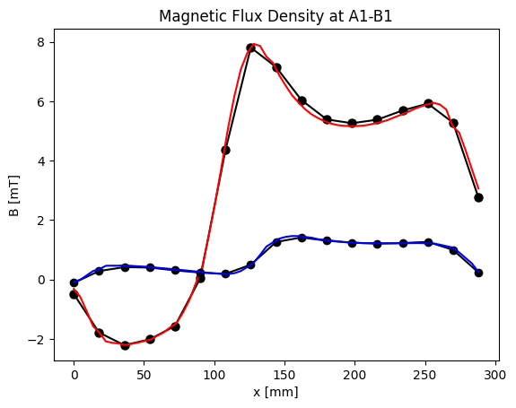

# Compumag Team 7: Asymmetrical Conductor with Hole

## Introduction

In the Compumag TEAM Problem 7[1] a thick aluminum plate with a hole is placed below an excitation
coil with a sinusoidal excitation. 

<em>Figure 1: The geometry of the benchmark. A coil is placed above an aluminium plate with a hole.</em>

  

Relevant models:

* Time-Harmonic Magnetics
* Excitation Coil

## Problem Description

The aluminium plate has conductivity of $\sigma=3.526 \times 10^7$. The stranded coil is excited with a sinusoidal coil current of 2742 AT of frequency of 50Hz (reference values of 200Hz also exist.). The results are compared to measurements of the magnetic flux 
density at various positions. We use the reference solution provided by Fujiwara et al.[2]. 

## Setup

We use third order solution. Note however that only a second order accurate geometry is used.

## Results

* **Magnetic Flux Density**

  We compare the calculated results with the results of the magnetic flux density we the provided results by [2]

  | Magnetic Flux Density A1-B1      |  Magnetic Flux Density A2-B2  |
  | -------------------------------- | -------------------------------- |
  |   |   |

  We observe a very good fit for both quantities.

## Scenes

* **Magnetic Flux Density (Abs)**

  

  
  

  

  <em>The absolute value of the magnetic flux density. </em>
  

## References

[1] https://www.compumag.org/wp/wp-content/uploads/2018/06/problem7.pdf

[2] Fujiwara K, Nakata T. Results for benchmark problem 7 (asymmetrical conductor with a hole). COMPEL-The international journal for computation and mathematics in electrical and electronic engineering. 1990 Mar 1;9(3):137-54.

