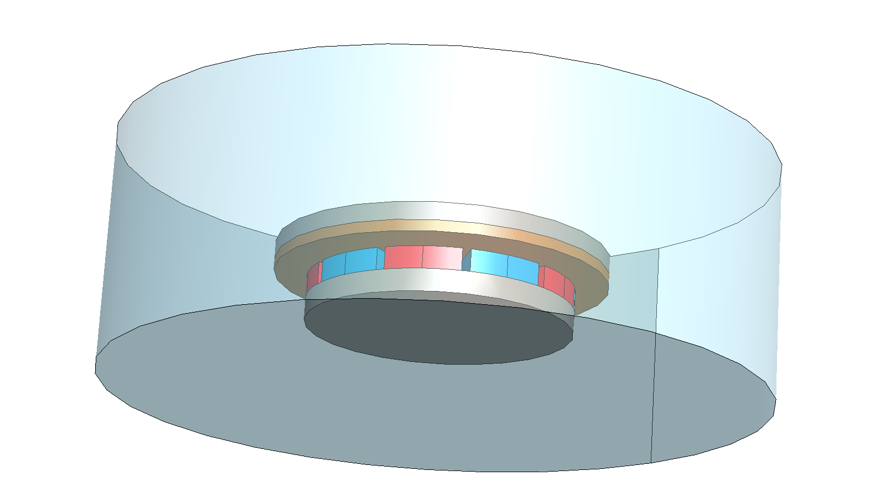
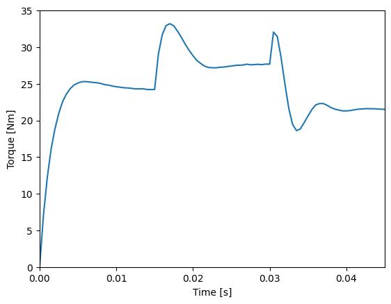
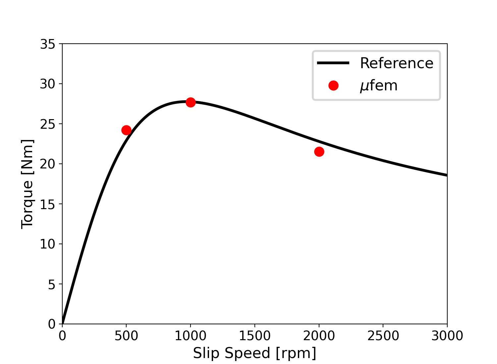
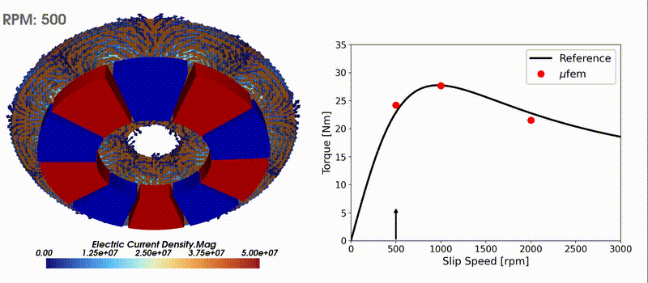

Below is a cleaned up, tightened, and technically precise version. Structure preserved, wording corrected, grammar fixed, and physics phrasing sharpened. No content added beyond what is necessary.

---

# Lubin 2015: Axial-Flux Eddy Current Brake

The publication [1] studies an axial-flux eddy current brake (or coupling) and derives an analytical solution for the resulting torque and axial force. Here, we compare these results with a fully transient finite-element simulation performed with **mufem**.

<div align="center">

</div>
<div align="center">
<em>Eddy current brake consisting of a conductive copper plate and a magnetic plate with permanent magnets.</em>
</div>
<br /><br />

## Introduction

The system consists of a magnetic plate carrying a collection of permanent magnets and a conductive copper plate separated by an air gap. Rotation of the copper plate induces eddy currents, which interact with the magnetic field and generate a braking torque opposing the motion.

The air gap thickness is chosen as 3 mm (the reference considers ( d = 3,\mathrm{mm} ), ( 5,\mathrm{mm} ), and ( 7,\mathrm{mm} )), and the magnetic plate uses 5 pole pairs ( p ). The copper plate thickness is ( d = 5,\mathrm{mm} ).

The back iron on both sides is modeled using the same linear magnetic material with relative permeability ( \mu_r = 1000 ). This linear approximation is justified, as the design avoids magnetic saturation.

Reference [1] provides analytical expressions for the braking torque and axial force as functions of the rotation rate, which are used here for comparison with the numerical results.

## Introducing Motion

The rotational motion can be applied either to the copper plate or to the magnetic plate using the `RigidBodyMotionModel`:

```python
rbm_model = RigidBodyMotionModel(
    mesh_motion_strategy=MeshMotionPartialRemeshing("Air" @ Vol)
)

motion = RotatingMotion(
        name="Rotation",
        marker=["Copper Plate", "Back Iron::Copper Side"] @ Vol,
        origin=[0.0, 0.0, 0.0],
        axis=[0.0, 0.0, 1.0],
        rotation_rate=0,
)

rbm_model.add_motion(motion)
sim.get_model_manager().add_model(rbm_model)
```

A naive rigid transformation of the mesh nodes belonging to the copper plate and its back iron would quickly lead to severe distortion of the surrounding air elements and eventually to invalid mesh cells (e.g. negative volumes). To avoid this, the motion handling must be specified explicitly.

Here, `MeshMotionPartialRemeshing` is used to remesh the surrounding air region at every time step, maintaining mesh quality while allowing large rotational displacements.

## Results

<div align="center">

</div>
<div align="center">
<em>Braking torque as a function of time.</em>
</div>
<br /><br />

Below is the braking torque vs the slip speed. 

<div align="center">

</div>
<div align="center">
<em>Braking torque as a function of slip speed.</em>
</div>
<br /><br />

The braking torque initially increases with slip speed because the induced electromotive force and the resulting eddy currents grow, strengthening the Lorentz force opposing the motion. As the slip speed increases further, the torque reaches a maximum and subsequently decreases. This reduction is caused by skin-depth effects and magnetic field shielding, which limit field penetration into the conductor and reduce the effective coupling between current and magnetic flux.


<div align="center">

</div>
<div align="center">
<em>Braking torque as a function of time.</em>
</div>

## References

[1] Lubin, T. and Rezzoug, A., 2015. *3-D analytical model for axial-flux eddy-current couplings and brakes under steady-state conditions*. IEEE Transactions on Magnetics, 51(10), pp. 1–12.
