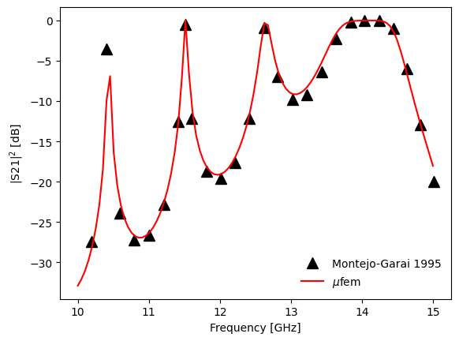

# Montejo-Garai 1995: Circular Cavity Filter

## Introduction

## Setup

### Mesh

### Model

### Excitation

### Reports

### Materials

## Running the case

<em>Figure 1: Transmission spectrum of the circular cavity filter.</em>

  

## References