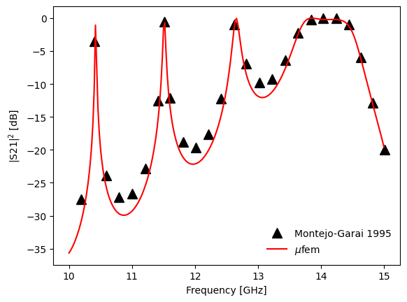
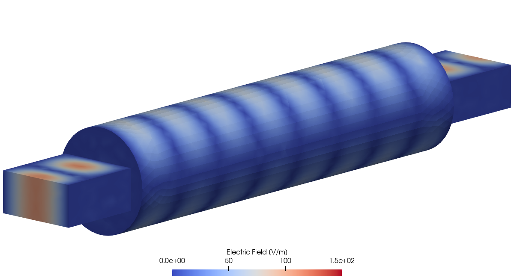

# Montejo-Garai 1995: Circular Cavity Filter

## Introduction

Waveguide filters are devices designed to pass signals only at certain frequencies. The main component of waveguide filters is a cavity resonator connected to the rest of the waveguide through a small input and output irises. The incident electromagnetic wave with a frequency matching the cavity's resonant frequency will pass through the cavity, while other frequencies will be reflected. In electronics, waveguide filters are used to isolate signals and reduce noise in devices like multiplexers, receivers, and transmitters, which serve as essential components in satellite communication systems, radars, telephone networks and television broadcasting.

In this test case we consider a microwave waveguide filter consisting of a circular resonator connected to the input and output rectangular waveguides via thin rectangular irises. Figure 1 shows the geometry of the filter.

<div align="center">
    
    <br/>
    <br/>
    Figure 1: Geometry of the waveguide circular cavity filter.
</div>
<br/>

The purpose of this test case is to calculate the transmission of a waveguide filter over a given frequency range to determine the frequencies at which the filter passes the incoming signal. We then compare the obtained results to the experimental results published in [[1]](#Montejo-Garai1995). We also visualize the electric field inside the filter obtained at one of the resonant frequencies of the cavity and at one frequency outside of the resonance.


## Setup

### Dimensions

Following [[1]](#Montejo-Garai1995) and [[2]](#Liu2002), we use the following dimensions of the waveguide filter components. The input and output waveguides are WR75 rectangular waveguides, with the width of 19.05 mm and height of 9.525 mm. The length of the waveguide sections is 20 mm. The circular cavity has a length of 100 mm and a radius of 12 mm. Finally, the connecting input and output irises have the width of 9.7 mm, the height of 3 mm, and the length of 1 mm.


### Mesh

To generate the mesh we use [Gmsh](https://gmsh.info/) mesh generator (please note that [Gmsh](https://gmsh.info/) is not supplied with $\mu$fem and must be installed separately). The corresponding code can be found in the [geometry.py](geometry.py) file. To improve the accuracy of modeling, we use the mesh with second-order finite elements. By using such a mesh, we can avoid artifacts that arise when trying to approximate a curved surface with flat finite elements. Figure 2 shows the resulting mesh.

<div align="center">
    
    <br/>
    <br/>
    Figure 2: The mesh created by Gmsh mesh generator.
</div>
<br/>

During the mesh generation, we assign named attributes to the waveguide input ("InputPort") and output ("OutputPort") ports, the walls of the waveguides and cavity ("Walls"), and the entire computational domain ("Domain").


### Model

For the simulation we use [Time-Harmonic Maxwell Model](https://raiden-numerics.github.io/mufem-doc/models/electromagnetics/time_harmonic_maxwell/time_harmonic_maxwell_model) which solves the following equation for the complex amplitude $\tilde{\mathbf{E}}$ of the electric field:

```math
\nabla \times \left(\frac{1}{\mu} \nabla \times \tilde{\mathbf{E}}\right) -
\varepsilon \omega^2 \tilde{\mathbf{E}} = 0,
```

where $\mu$ and $\varepsilon$ are the permeability and the permittivity of the material filling the waveguides and the cavity, and $\omega = 2\pi f$ is the angular frequency of the incoming radiation of frequency $f$.

As the boundary conditions we use the [Perfect Electric Conductor Condition](https://raiden-numerics.github.io/mufem-doc/models/electromagnetics/time_harmonic_maxwell/conditions/perfect_electric_conductor_condition) for the walls of the waveguides and cavity, together with the [Input Port Condition](https://raiden-numerics.github.io/mufem-doc/models/electromagnetics/time_harmonic_maxwell/conditions/input_port_condition) and the [Output Port Condition](https://raiden-numerics.github.io/mufem-doc/models/electromagnetics/time_harmonic_maxwell/conditions/output_port_condition) for the input and output ports of the waveguides.

As the incident electric field we consider the field in the TE$_{10}$ mode, entering through the input port of the waveguide.

We also assume that the volume of the waveguides and the cavity is filled with air, which we model using the [Constant](https://raiden-numerics.github.io/mufem-doc/models/electromagnetics/time_harmonic_maxwell/materials/time_harmonic_maxwell_material_constant) time-harmonic Maxwell material with the permeability and permittivity of free space.


### Reports

To calculate what fraction of the incident radiation passes through the filter, we use the [S-parameters Report](https://raiden-numerics.github.io/mufem-doc/models/electromagnetics/time_harmonic_maxwell/reports/s_parameters_report). This report calculates scattering parameters, or S-parameters, which describe the input-output relationships between various ports of a device. In our case, we are interested in the $S_{21}$ parameter, which plays the role of the filter transmission coefficient and is determined by the formula:

```math
S_{21} = \frac{\int_{\Gamma_2} \tilde{\mathbf{E}} \cdot \tilde{\mathbf{e}}_1\, d\Gamma}
              {\int_{\Gamma_2} \tilde{\mathbf{e}}_1 \cdot \tilde{\mathbf{e}}_1\, d\Gamma},
```

where $\tilde{\mathbf{E}}$ is the amplitude of the electric field obtained as a result of the simulation, $\tilde{\mathbf{e}}_1$ is the first mode of the waveguide (the TE$_{10}$ mode in the case of rectangular waveguides), and the integration is performed over the plane of the output port (arbitrarily indexed by the number 2). The $S_{21}$ parameter shows what portion of radiation emitted from the input port reaches the output port in the form of the TE$_{10}$ mode.


## Running the case

To launch the simulation we use the [case.py](case.py) file using the following terminal command:
```bash
pymufem case.py
```

Inside [case.py](case.py) we iterate through input frequencies in the range of 10 to 15 GHz using the following loop:
```py
for i, frequency in enumerate(frequencies):
    model.set_frequency(frequency)
    steady_runner.advance(1)

    if frequency in frequencies_paraview:
        vis.save()

    report_data = report_s_parameters.evaluate().to_numpy()
    S21[i] = report_data[0, 0]
```
At each iteration, we extract the data corresponding to $S_{21}$ parameter and store it in a separate array. For two frequencies 12 and 14 GHz stored in the list `frequencies_paraview`, we save the electric field in the [VTK](https://vtk.org/) file format for subsequent visualization with [ParaView](https://www.paraview.org/). Figure 3 shows the squared magnitude of the obtained $S_{21}$​ parameter as a function of frequency.

<div align="center">
    
    <br/>
    Figure 3: Transmission spectrum (the squared magnitude of S21​ parameter as a function of frequency) of the waveguide circular cavity filter.
</div>
<br/>

In Fig. 3 we can see that the transmission spectrum of the waveguide circular filter has a number of resonances around 10.4, 11.5, and 12.6 GHz, as well as a fairly wide bandwidth from 13.8 to 14.5 GHz. Radiation emitted at these frequencies passes through the filter with minimal loss, while radiation at other frequencies is reflected back. Figure 3 also shows that the results of our simulations are in a very good agreement with the experimental data presented in [[1]](#Montejo-Garai1995).

To illustrate the electric field configuration inside the filter at frequencies both within and outside the filter's bandwidth, during the simulation we export the electric field at 12 GHz and 14 GHz to a [VTK](https://vtk.org/) file. For the visualization of the fields we use [ParaView](https://www.paraview.org/) (please note that [ParaView](https://www.paraview.org/) is not supplied with $\mu$fem and must be installed separately). You can find the corresponding code in the [create_scene.py](create_scene.py) file. Figure 4 shows the distribution of the electric field inside the waveguide filter at both frequencies.

<div align="center">
  
  
  <br/>
  <br/>
  Figure 4: Electric field magnitude inside the waveguide filter at frequency 12 GHz (left) and 14 GHz (right).
</div>
<br/>

We see that at 12 GHz, most of the electric field entering through the input port is reflected back. At the same time, an electric field at the frequency of 14 GHz passes through the circular cavity without obstruction. This observation is in complete agreement with Figure 3.


## References

<a id="Montejo-Garai1995"></a> [1] J.R. Montejo-Garai and J. Zapata, "Full-wave design and realization of multicoupled dual-mode circular waveguide filters", IEEE Transactions on Microwave Theory and Techniques, 43, 1290 (1995) https://doi.org/10.1109/22.390185

<a id="Liu2002"></a> [2] J. Liu, J.-M. Jin, E.K.N. Yung and R.S. Chen,  "A fast, higher order three-dimensional finite-element analysis of microwave waveguide devices", Microwave and Optical Technology Letters, 32, 344 (2002) https://doi.org/10.1002/mop.10174
