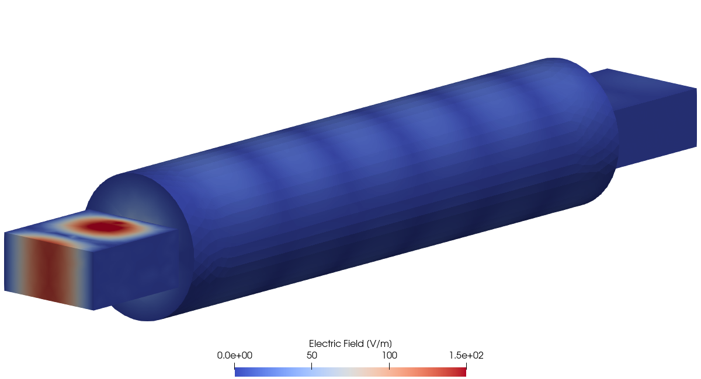

# Montejo-Garai 1995: Circular Cavity Filter

## Introduction

Waveguide filters are devices designed to pass signals only at certain frequencies. The main component of waveguide filters is a cavity resonator connected to the rest of the waveguide through a small input and output irises. The incident electromagnetic wave with a frequency matching the cavity's resonant frequency will pass through, while other frequencies will be reflected. In electronics, waveguide filters are used to isolate signals and reduce noise in devices like multiplexers, receivers, and transmitters, which serve as essential components in satellite communication systems, radars, telephone networks and television broadcasting.

In this test case we consider a microwave waveguide filter consisting of a circular resonator connected to the input and output rectangular waveguides via thin rectangular irises. The following figure shows the geometry of the filter.

<div align="center">
    
    <br/>
    <br/>
    Figure 1: Geometry of the waveguide circular cavity filter.
</div>
<br/>
<br/>

The purpose of this test case is to calculate the transmission of a waveguide filter over a given frequency range to determine the frequencies at which the filter passes the incoming signal. We then compare the obtained results to the experimental results published in [[1]](#Montejo-Garai1995). We also visualize the electric field inside the filter obtained at one of the resonant frequencies of the cavity and at one frequency outside of the resonance.


## Setup

### Dimensions

Following [[1]](#Montejo-Garai1995) and [[2]](#Liu2002), we use the following dimensions of the waveguide filter components. The input and output waveguides are WR75 rectangular waveguides, with the width of 19.05 mm and height of 9.525 mm. The length of the waveguide sections is 20 mm. The circular cavity has a length of 100 mm and a radius of 12 mm. Finally, the connecting input and output irises have the width of 9.7 mm, the height of 3 mm, and the length of 1 mm.


### Mesh

To generate the mesh we use [Gmsh](https://gmsh.info/) mesh generator. The corresponding code can be found in the [geometry.py](geometry.py) file. To improve the accuracy of modeling, we use the mesh with second-order finite elements. By using such a mesh, we can avoid artifacts that arise when trying to approximate a curved surface with flat finite elements. The following figure shows the resulting mesh.

<div align="center">
    
    <br/>
    <br/>
    Figure 2: The mesh created by Gmsh mesh generator.
</div>
<br/>
<br/>

During mesh generation, we assign named attributes to the waveguide input ("InputPort") and output ("OutputPort") ports, the walls of the waveguides and cavity ("Walls"), and the entire computational domain ("Domain").


### Model

For the simulation we use [Time-Harmonic Maxwell Model](https://www.raiden-numerics.com/mufem/models/electromagnetics/time_harmonic_maxwell/time_harmonic_maxwell_model.html) which solves the following equation for the complex amplitude $\tilde{\mathbf{E}}$ of the electric field:

```math
\nabla \times \left(\frac{1}{\mu} \nabla \times \tilde{\mathbf{E}}\right) -
\varepsilon \omega^2 \tilde{\mathbf{E}} = 0.
```

Here $\mu$ and $\varepsilon$ are the permeability and the permittivity of the material filling the waveguides and the cavity, and $\omega = 2\pi f$ is the angular frequency of the incoming radiation of frequency $f$.

As the boundary conditions we use the [Perfect Electric Conductor Condition](https://www.raiden-numerics.com/mufem/models/electromagnetics/time_harmonic_maxwell/conditions/perfect_electric_conductor_condition.html) for the walls of the waveguides and cavity, together with the [Input Port Condition](https://www.raiden-numerics.com/mufem/models/electromagnetics/time_harmonic_maxwell/conditions/input_port_condition.html) and the [Output Port Condition](https://www.raiden-numerics.com/mufem/models/electromagnetics/time_harmonic_maxwell/conditions/output_port_condition.html) for the input and output ports of the waveguides.

As the incident electric field we consider the field in the TE$_{10}$ mode, entering through the input port of the waveguide.

We also assume that the volume of the waveguides and the cavity is filled with air, which we model using the [Vacuum](https://www.raiden-numerics.com/mufem/models/electromagnetics/time_harmonic_maxwell/materials/time_harmonic_maxwell_material_vacuum.html) material with the permeability and permittivity of free space.


### Reports


## Running the case

<div align="center">
    
    <br/>
    Figure 2: Transmission spectrum of the circular cavity filter.
</div>
<br/>
<br/>


| Out of resonance (12 GHz) | At resonance (14 GHz) |
| - | - |
|  |  |

## References

<a id="Montejo-Garai1995"></a> [1] J.R. Montejo-Garai and J. Zapata, "Full-wave design and realization of multicoupled dual-mode circular waveguide filters", IEEE Transactions on Microwave Theory and Techniques, 43, 1290 (1995) https://doi.org/10.1109/22.390185

<a id="Liu2002"></a> J. Liu, J.-M. Jin, E.K.N. Yung and R.S. Chen,  "A fast, higher order three-dimensional finite-element analysis of microwave waveguide devices", Microwave and Optical Technology Letters, 32, 344 (2002) https://doi.org/10.1002/mop.10174
