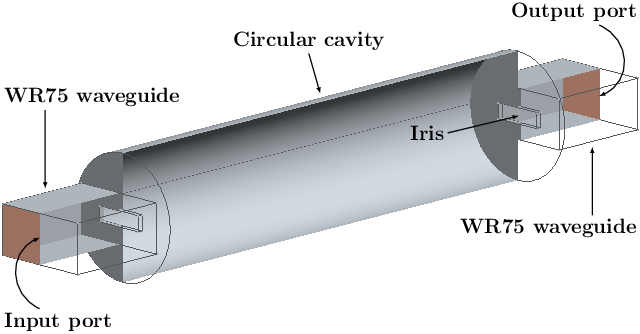

# Montejo-Garai 1995: Circular Cavity Filter

## Introduction

    
     
     
    Figure 1: Geometry. Circular cavity filter.

 
 

## Setup

### Mesh

    
     
     
    Figure 2: Mesh. Circular cavity filter.

 
 

### Model

### Excitation

### Reports

### Materials

## Running the case

    
     
    Figure 2: Transmission spectrum of the circular cavity filter.

 
 

| Out of resonance (12 GHz) | At resonance (14 GHz) |
| - | - |
|  |  |

## References