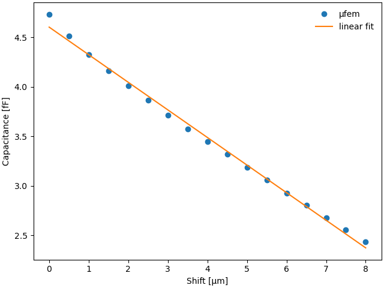

# Ren 2014: MEMS Comb Drive

## Introduction

## Setup

### Dimensions

### Mesh

### Model

### Reports

### Adaptive mesh refinement

## Running the case

## References

Comb drives are capacitive actuators that utilize electrostatic forces generated between two electrically conductive combs. These actuators typically function at the micro- or nanometer scale and are among the most widely used electrostatic actuators and sensors in the micro-electromechanical systems (MEMS) industry. When a voltage is applied between the static and moving combs, attractive electrostatic forces are created, drawing them together. The force produced by the actuator is proportional to the change in capacitance between the two combs, which increases with the driving voltage.

In this test case, we monitor the capacitance of the comb drive described in [[1,2]](#Ren2014). This comb drive consists of two comb conductors, one with four teeth and the other with three, positioned above a grounded plate. Figure 1 shows the geometry of the problem.

<em>Electrostatic MEMS comb driver (the surrounding box with the ground plane is not shown)</em>

  

## Introduction

For the simulation, we employ the [Electrostatics Model](https://raiden-numerics.github.io/mufem-doc/models/electromagnetics/electrostatics/electrostatics_model.html), which describes a static electric field $\mathbf{E}$ in terms of its scalar electric potential $\phi$ using the following equation:
$$
    \nabla \cdot \varepsilon \nabla\phi = -\rho,
$$
where $\varepsilon$ is the electric permittivity, and $\rho$ denotes the density of free electric charges, which is zero in our case. By solving this equation we calculate the total electric energy density $W=\varepsilon\mathbf{E}^2/2$ with $\mathbf{E}=-\nabla\phi$. Knowing the energy $W$ and the voltage $V$ imposed between the two comb electrodes we can find the capacitance $C$ of the comb drive as [[3]](#Wikipedia)
$$
    C = \frac{2 W}{V^2}.
$$

## Setup

The dimensions of the comb drive components are illustrated in Fig. 3 of [[1]](#Ren2014). To simulate the entire system, we enclose the comb drive within a rectangular box, with one boundary serving as the ground plate. The potentials on the two comb electrodes are set to 0 V for the four-tooth electrode and 1 V for the three-tooth electrode, while the ground plate is maintained at 0 V.

To generate the mesh, we utilize [Gmsh](https://gmsh.info/) mesh generator. To enhance simulation speed without compromising precision, we implement the adaptive mesh refinement algorithm. Figure 2 illustrates the initial mesh configuration.

    
     
     
    Figure 2: The initial mesh configuration.

 

## Results

* **Effect of mesh refinement**

    | Initial mesh | Mesh after several refinement cycles  |
    | ---          | --- |
    |  | 

* **Electric Potential**

    
     
     
    Figure 3: The mesh created by Gmsh mesh generator.

 

* **Capacitance**

    

    

    Calculated using the formula $C = 2 W / V^2$

    | Obtained (fF) | Reference value from [[1]](#Ren2014) (fF)|
    | -             | -                            |
    | 5.375         | 5.372                        |

## References
 [1] Z. Ren and X. Xu, "Dual Discrete Geometric Methods in Terms of Scalar Potential on Unstructured Mesh in Electrostatics," IEEE Transactions on Magnetics, 50, 37, (2014) https://doi.org/10.1109/TMAG.2013.2280452

 [2] D.A. Di Pietro and R. Specogna, "An a posteriori-driven adaptive Mixed High-Order method with application to electrostatics", Journal of Computational Physics, 326, 35 (2016) https://doi.org/10.1016/j.jcp.2016.08.041

 [3] https://en.wikipedia.org/wiki/Comb_drive