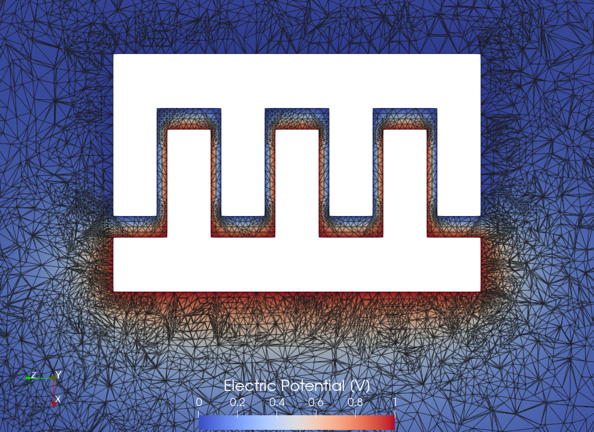
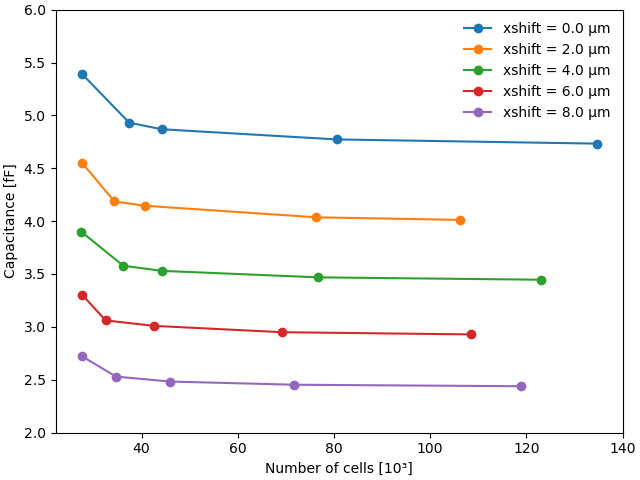

# Ren 2014: MEMS Comb Drive

## Introduction

Comb drives are capacitive actuators that utilize electrostatic forces generated between two electrically conductive combs. These actuators typically function at the micro- or nanometer scale and are among the most widely used electrostatic actuators and sensors in the micro-electromechanical systems (MEMS) industry. When a voltage is applied between the static and moving combs, attractive electrostatic forces are created, drawing them together. The force produced by the actuator is proportional to the change in capacitance between the two combs, which increases with the driving voltage.

In this test case, we monitor the capacitance of the comb drive described in [[1,2]](#Ren2014). This comb drive consists of two comb conductors, one with four teeth and the other with three, positioned above a grounded plate. Figure 1 shows the geometry of the problem.

<div align="center">
    
    <br/>
    <br/>
    Figure 1: Electrostatic MEMS comb drive.
</div>
<br/>

By varying the distance between the combs, we can observe changes in capacitance, which enables us to estimate the force generated by the comb drive.


## Setup

### Dimensions

The exact dimensions of the comb drive components are illustrated in Fig. 3 of [[1]](#Ren2014). Briefly, the width of the teeth is 4 μm, the gap between the teeth is 1 μm, and the distance to the ground plate is 6 μm.


### Mesh

To simulate the entire system, we enclose the comb drive within a rectangular box, with one boundary serving as the ground plate. To generate the mesh, we utilize [Gmsh](https://gmsh.info/) mesh generator. To enhance simulation speed without compromising precision, we implement the adaptive mesh refinement algorithm. Figure 2 illustrates the initial mesh configuration.

<div align="center">
    
    <br/>
    <br/>
    Figure 2: The initial mesh configuration.
</div>
<br/>

During the mesh generation process, we assign named attributes to the surfaces of each comb ("Comb1" and "Comb2"), to the boundary of the computational domain representing the ground plate ("Ground"), and to the entire computational domain itself ("Domain").

To investigate the change in capacitance as the distance between the combs increases, we prepare a function `create_geometry` which generates the mesh for a given shift of the combs relative to each other and then writes it to a file. We begin with a zero shift, corresponding to an initial distance of 1 μm between the combs. Subsequently, we increase the inter-comb distance from this initial value by shifting the combs in increments of 0.5 μm, up to a final shift of 8 μm, at which point the combs no longer interlock.


### Model

For the simulation, we employ the [Electrostatics Model](https://raiden-numerics.github.io/mufem-doc/models/electromagnetics/electrostatics/electrostatics_model.html), which describes a static electric field $\mathbf{E}$ in terms of its scalar electric potential $\phi$ using the following equation:
```math
    \nabla \cdot \varepsilon \nabla\phi = -\rho,
```
where $\varepsilon$ is the electric permittivity, and $\rho$ denotes the density of free electric charges, which is zero in our case. By solving this equation we calculate the total electric energy density $W=\varepsilon\mathbf{E}^2/2$ with $\mathbf{E}=-\nabla\phi$. Knowing the energy $W$ and the voltage $V$ imposed between the two comb electrodes we can find the capacitance $C$ of the comb drive as [[3]](#Wikipedia)
```math
    C = \frac{2 W}{V^2}.
```

The potentials on the two comb electrodes are set to 0 V for the four-tooth electrode and 1 V for the three-tooth electrode, while the ground plate is maintained at 0 V. In order to implement these voltages we use the [Electric Potential Condition](https://raiden-numerics.github.io/mufem-doc/models/electromagnetics/electrostatics/conditions/electric_potential_condition.html).

We also assume that the computational domain is filled with air, which we model using the [Constant](https://raiden-numerics.github.io/mufem-doc/models/electromagnetics/electrostatics/materials/electrostatics_material_constant.html) electrostatic material with the electric permittivity of free space.


### Reports

To calculate the energy $W$ we use the Volume Integral Report, which integrates the Electric Energy Density over the computational domain:
```py
report = VolumeIntegralReport(
    name="Electric Energy Density Report", cff_name="Electric Energy Density",
)
```

## Running the case

To initiate the simulation, we use the [case.py](case.py) file with the following terminal command:
```bash
pymufem case.py
```

Inside the [case.py](case.py) file we have the following double loop:
```py
for xshift in xshifts:
    if sim.get_machine().is_main_process():
        create_geometry(xshift)

    sim.get_domain().load_mesh("geometry.msh")
    sim.get_domain().get_mesh().scale(1e-6)

    for i in range(max_iterations):
        runner.advance(2)

        if i == 0:
            vis.save()

        ncells = sim.get_domain().get_mesh().get_total_number_cells()
        energy = report.evaluate()
        capacitance = 2 * energy / voltage**2  # [F]

        if sim.get_machine().is_main_process():
            with open("results/Capacitance.csv", "a") as fp:
                fp.write(f"{xshift:.1f}, {ncells}, {capacitance}\n")

        if ncells >= max_ncells:
            break
        else:
            refinement_model.refine_mesh()

    else:
        raise RuntimeError(
            "Maximum number of iterations reached without reaching max_ncells."
        )

    vis.save()
```
The external `for` loop iterates through all inter-comb shifts. At the start of each iteration, we generate the corresponding geometry by invoking `create_geometry(xshift)`, which writes the associated mesh to a file. Meanwhile, the internal `for` loop refines the mesh according to the established mesh refinement algorithm. This loop continues until the number of mesh elements surpasses the empirically determined limit of `max_ncells`, which is set at 100,000. For each mesh file, we save the electric potential obtained from both the initial and final meshes in the [VTK](https://vtk.org/) file format, allowing for subsequent visualization using [ParaView](https://www.paraview.org/).


## Results

### The effect of adaptive mesh refinement

In this test case, we utilize adaptive mesh refinement (AMR) to improve the simulation's efficiency. AMR employs a specific algorithm that calculates local error based on the current solution and subdivides only the elements with the highest error. Consequently, AMR allows for local refinement of the mesh in areas where it is essential to enhance the solution, while leaving the mesh in other regions of the computational domain unaffected. The parameters of the mesh refinement algorithm can be adjusted using the model-specific Mesh Refiner:
```py
mesh_refiner = model.get_mesh_refiner()
mesh_refiner.set_refinement_fraction(0.6)
```
For instance, in the code above, we set the mesh refinement fraction to 0.6, indicating that only 40% of the elements with the highest error will be refined.

As an example, Figure 3 illustrates the calculated electric field potential along with the mesh edges for both the initial mesh and the mesh after several cycles of adaptive mesh refinement. Notably, the mesh becomes denser near the edges of the combs, where the electric potential changes most significantly.

<div align="center">
  
  
  <br/>
  <br/>
  Figure 3: A slice of the computational domain displaying the calculated electric field potential along with the mesh edges for two different meshes: (left) the initial mesh and (right) the mesh after several cycles of adaptive mesh refinement. The images are obtained using <a href="paraview_mesh.py">paraview_mesh.py</a> file.
</div>
<br/>


With each refinement cycle, the number of degrees of freedom increases. Figure 4 illustrates how the calculated capacitance value changes as the number of degrees of freedom grows. It is clear that the capacitance value at the initial mesh is overestimated; however, with each subsequent mesh refinement cycle, it decreases. After a certain number of refinement cycles, the capacitance value stabilizes and reaches its final value.

<div align="center">
    
    <br/>
    <br/>
    Figure 4: The relationship between capacitance and the number of cells for various inter-comb shifts. The plot is obtained using <a href="capacitance_vs_ncells.py">capacitance_vs_ncells.py</a> file.
</div>
<br/>

The final value of the capacitance is taken as the value calculated at the largest number of degrees of freedom.


### Electric Potential

Figure 5 illustrates how the distribution of electric potential changes as the shift between the combs increases. This movement mimics the action of a real comb drive, where the combs tend to move apart when voltage is applied.

<div align="center">
    
    <br/>
    <br/>
    Figure 5: The distribution of electric potential for various shifts between the combs. The git animation is obtained using <a href="paraview_gif.py">paraview_gif.py</a> file.
</div>
<br/>


### The developed force

The force $F$ generated by the comb drive can be estimated using the following expression [[3]](#Wikipedia):
```math
F = \frac{1}{2} \frac{\partial C}{\partial x} V^2,
```
where $\partial C/\partial x$ represents the change in capacitance with respect to distance between the combs, and $V$ is the applied voltage.

To calculate the derivative $\partial C/\partial x$​ in Figure 6, we plot the capacitance against the shift distance. As observed, the capacitance decreases linearly as the distance between the combs increases. By applying a linear fit, we can extract the value of $\partial C/\partial x$​, which in this case is equal to $-3.1\times10^{-10}$ F/m. Using this value in the formula provided earlier, we can estimate that the comb drive generates a force $F$ with an amplitude of 0.152 nN.

<div align="center">
    
    <br/>
    <br/>
    Figure 6: Dependence of the comb drive capacitance on the distance between the combs, along with its linear fit. The plot is obtained using <a href="capacitance_vs_xshift.py">capacitance_vs_xshift.py</a> file.
</div>
<br/>


## References

<a id="Ren2014"></a> [1] Z. Ren and X. Xu, "Dual Discrete Geometric Methods in Terms of Scalar Potential on Unstructured Mesh in Electrostatics," IEEE Transactions on Magnetics, 50, 37, (2014) https://doi.org/10.1109/TMAG.2013.2280452

<a id="DiPietro2016"></a> [2] D.A. Di Pietro and R. Specogna, "An a posteriori-driven adaptive Mixed High-Order method with application to electrostatics", Journal of Computational Physics, 326, 35 (2016) https://doi.org/10.1016/j.jcp.2016.08.041

<a id="Wikipedia"></a> [3] https://en.wikipedia.org/wiki/Comb_drive
