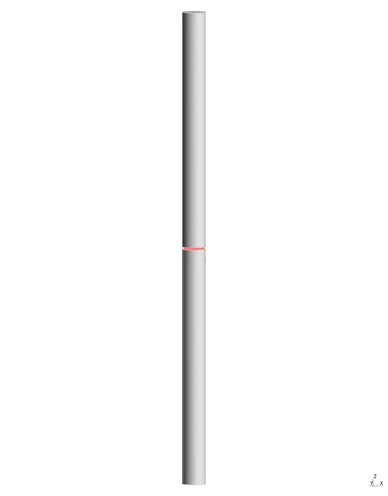
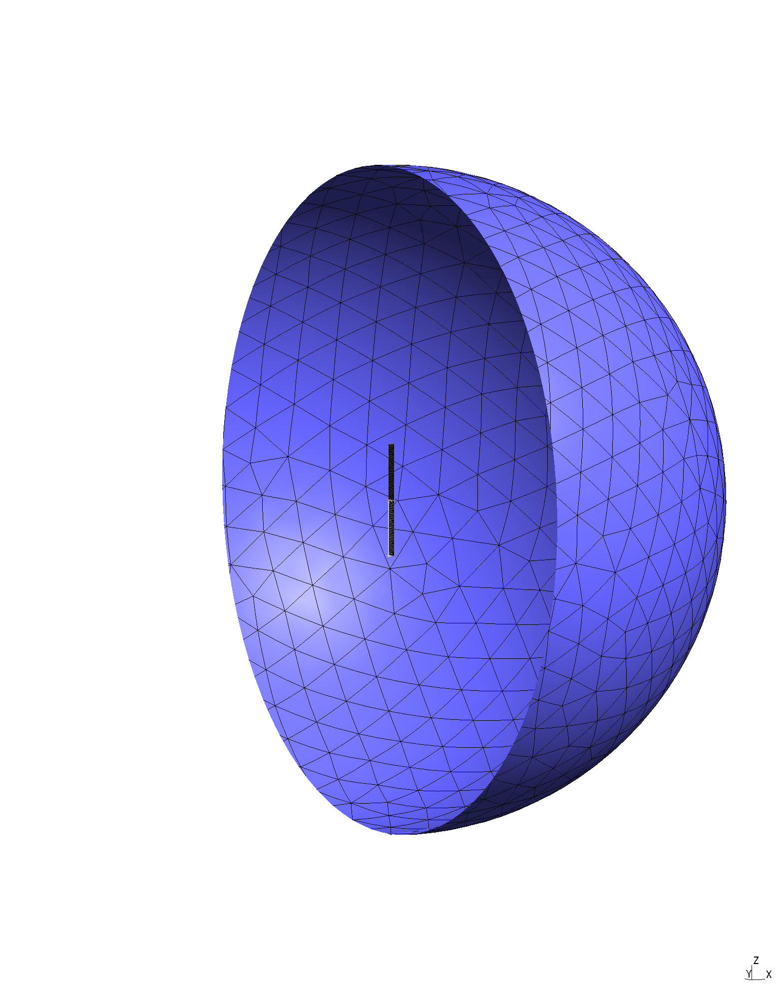
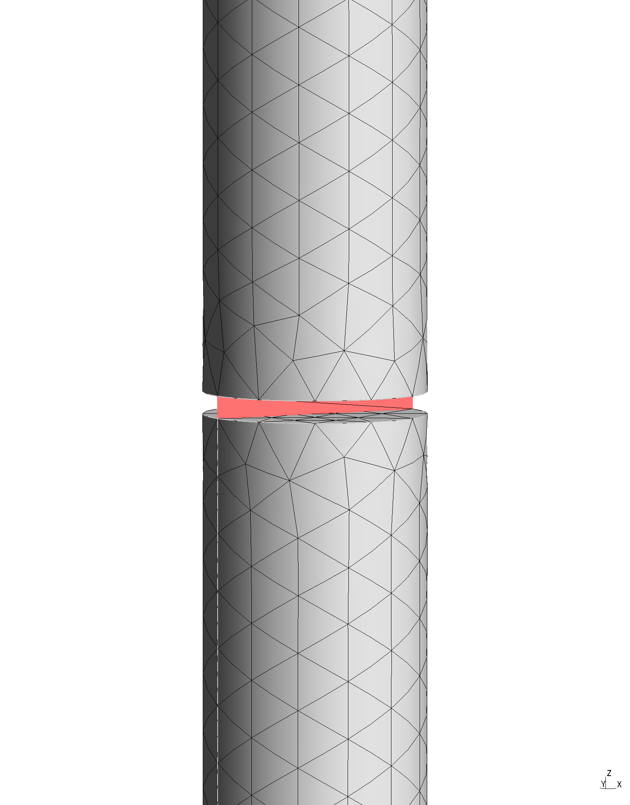
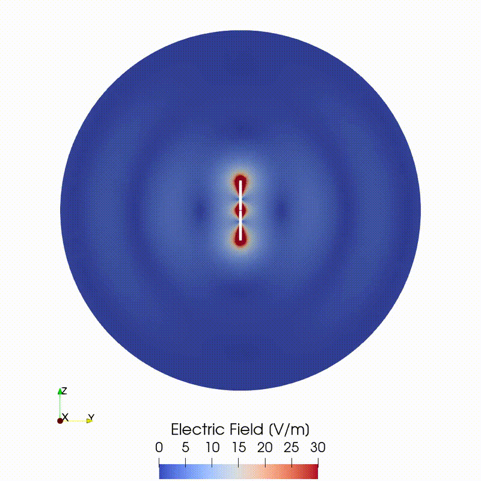
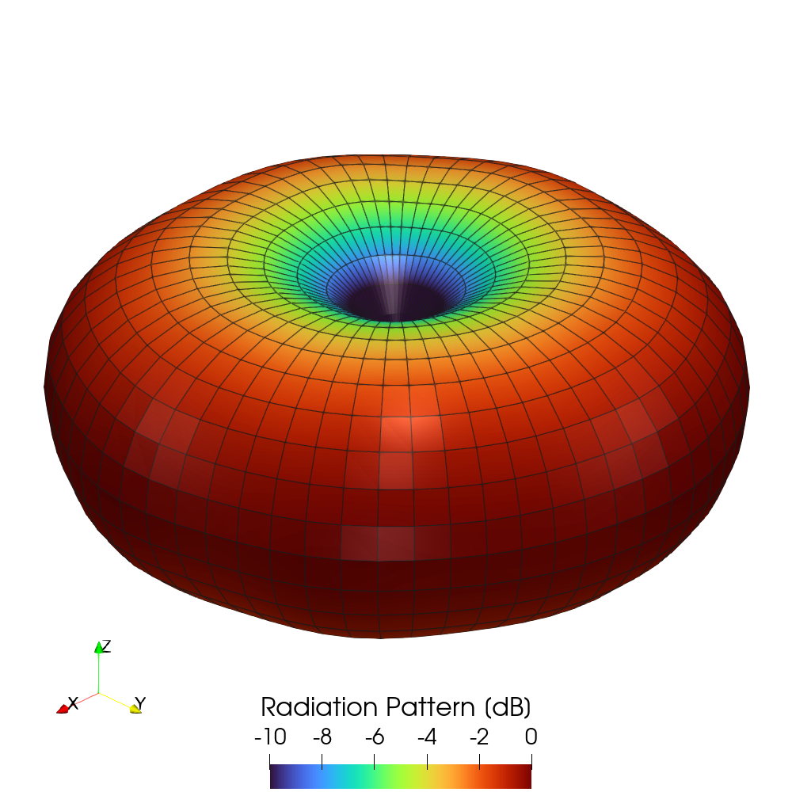
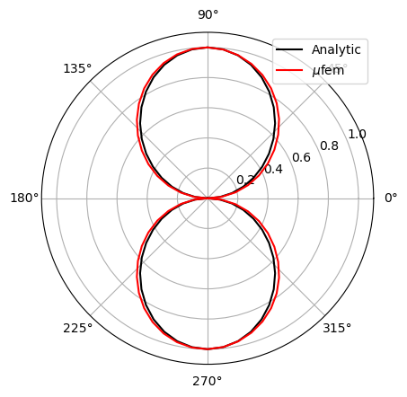
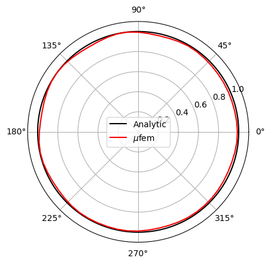

# Stutzman 2012: Dipole Antenna


## Introduction

The dipole antenna is one of the simplest and most widely used types of antenna
[[1]](#references).
It consists of two thin metallic rods that have a sinusoidal voltage difference
applied between them.
The length of the rods is equal to a quarter of the wavelength at the operating
frequency.
This design produces a donut-shaped radiation pattern that approximates that of
an elementary electric dipole.
Simple yet versatile, dipole antennas are used in various applications,
including Wi-Fi, cellular, GPS, and amateur radio, serving as basic radiating
elements or components in more complex designs.

<div align="center">
    
    <br/>
    <br/>
    Figure 1: Geometry of the dipole antenna.
</div>
<br/>


## Setup

In our simulation, the dipole antenna consists of two perfectly conducting
cylinders modeled using the
[Perfect Electric Conductor Condition](https://raiden-numerics.github.io/mufem-doc/models/electromagnetics/time_harmonic_maxwell/conditions/perfect_electric_conductor.html)).
Each cylinder has a length of $L=1$ m and a radius of $a=L/20=5$ cm, separated
by a narrow gap of length $l=L/100=1$ cm.
Given these geometric parameters, the operating wavelength is approximately
$\lambda=4$ m, corresponding to a frequency of $f=0.0749$ GHz.
This design is inspired by [[2]](#references).

The gap acts as the excitation point for the antenna.
The feeding circuit is modeled using a
[Lumped Port Condition](https://raiden-numerics.github.io/mufem-doc/models/electromagnetics/time_harmonic_maxwell/conditions/lumped_port.html),
applied to a flat rectangular strip connecting the two arms of the antenna.

The antenna is surrounded by free space, represented in the model by an
enclosing sphere of radius $r=1.5\lambda=6$ m, centered at the origin.
An
[Absorbing Boundary Condition](https://raiden-numerics.github.io/mufem-doc/models/electromagnetics/time_harmonic_maxwell/conditions/absorbing.html)
is applied to the sphere's boundary to simulate an infinite domain.

The problem geometry and corresponding mesh are generated in the
[geometry.py](geometry.py) file using the [Gmsh](https://gmsh.info/) mesh
generator.
To achieve higher precision, we set the maximum size of the mesh elements to
one-fifth of the radiation wavelength $\lambda$:

```py
gmsh.option.setNumber("Mesh.MeshSizeMax", wavelength / 5)
```
Additionally, we employ second-order mesh elements to ensure at least 12
elements per $2\pi$ radians of the mesh curvature:

```py
gmsh.option.setNumber("Mesh.ElementOrder", 2)
gmsh.option.setNumber("Mesh.HighOrderOptimize", 2)
gmsh.option.setNumber("Mesh.MeshSizeFromCurvature", 12)
```

This approach results in a smoother mesh around the cylindrical arms of the
antenna. The resulting mesh is illustrated in Fig. 2.

<div align="center">
    
    
    <br/>
    <br/>
    Figure 2: Mesh generated by Gmsh: (left) general view; (right) zoomed-in
    view of the feeding port region.
</div>
<br/>


The complete code for the simulation can be found in the [case.py](case.py)
file.
For this simulation, we utilize the
[Time-Harmonic Maxwell Model](https://raiden-numerics.github.io/mufem-doc/models/electromagnetics/time_harmonic_maxwell/model.html)
with a finite element polynomial degree of two for enhanced precision:

```py
model = TimeHarmonicMaxwellModel(
    marker="Domain" @ Vol,
    frequency=0.0749e9,  # [Hz]
    order=2,  # finite element polynomial degree
)
```

We assume that the domain surrounding the antenna is filled with air, which we
model using the time-harmonic Maxwell
[General Material](https://raiden-numerics.github.io/mufem-doc/models/electromagnetics/time_harmonic_maxwell/materials/general.html)
with the permeability and permittivity of free space:

```py
material = TimeHarmonicMaxwellGeneralMaterial.Constant(
    name="Air",
    marker="Domain" @ Vol,
)
```

To run the simulation, use the [case.py](case.py) file along with the following
terminal command:

```bash
pymufem case.py
```

## Results

### Electric Field

To visualize the resulting electric field, we export it to a VTK file, as
outlined in the
[Visualization](https://raiden-numerics.github.io/mufem-doc/framework/visualization.html)
section of the documentation.
We then use the script from the
[paraview_electric_field.py](paraview_electric_field.py) file to plot it in
ParaView.
Figure 3 illustrates the electric field radiated by the antenna.
As can be seen, the field distribution of a dipole antenna closely resembles
that generated by an elementary dipole.


<div align="center">
    
    <br/>
    <br/>
    Figure 3: Distribution of the electric field magnitude |E| in the yz-plane.
</div>
<br/>


### Radiation pattern

To visualize the antenna's radiation pattern, we employ the
[Far-Field Radiation Sensor](https://raiden-numerics.github.io/mufem-doc/models/electromagnetics/time_harmonic_maxwell/reports/far_field_radiation_sensor.html)
to generate the far-field data.
Subsequently, we utilize the
[paraview_radiation_pattern.py](paraview_radiation_pattern.py) file to plot it
in ParaView.
As shown in Fig. 4, the resulting radiation pattern exhibits a donut-like shape,
characteristic of dipole radiation.

<div align="center">
    
    <br/>
    <br/>
    Figure 4: Far-field radiation pattern.
</div>
<br/>

To further assess how closely the radiation of the dipole antenna aligns with
that of an ideal dipole, we compare the simulated radiation pattern
cross-sections to the analytical solution for a radiating elementary dipole
[[3]](#references):

```math
    E(\theta,\phi)
    = \left|
        \frac{\cos\left(\frac{\pi}{2} \cos\theta\right)} {\sin\theta}
      \right|,
```

where $\theta$ is the azimuthal angle and $\phi$ is the polar angle.
The corresponding script can be found in the
[radiation_pattern_cross_sections.py](radiation_pattern_cross_sections.py) file.
As depicted in Fig. 5., the simulated radiation pattern closely matches the
analytical result.

<div align="center">
    
    
    <br/>
    <br/>
    Figure 5: Cross-sections of the far-field radiation pattern:
    (left) E-pane cross-section and (right) H-plane cross-section.
</div>
<br/>


## References
[1] https://en.wikipedia.org/wiki/Dipole_antenna \
[2] https://awslabs.github.io/palace/stable/examples/antenna \
[3] W.L. Stutzman and G.A. Thiele "Antenna Theory and Design", 3rd ed., John Wiley & Sons (2012)