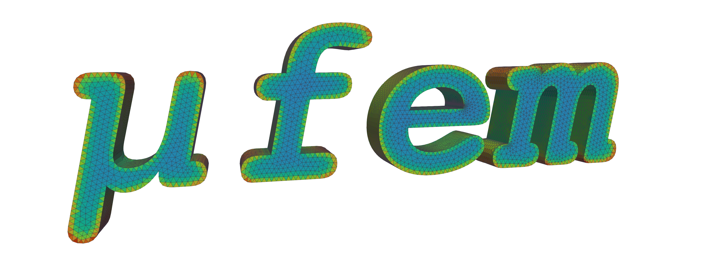

# μfem

A finite-element multi-physics application framework based on [MFEM](https://mfem.org/) library.



See the [μfem documentation](https://raiden-numerics.github.io/mufem-doc/index.html) for more details.

For questions or support please [create an issue](https://github.com/Raiden-Numerics/mufem-release/issues/new/choose).

## Validation cases

A collection of validation examples for μfem (tested with [version](VERSION)).
To run the validations please make sure to follow the [Installation](https://raiden-numerics.github.io/mufem-doc/getting_started/installation.html) instructions. To execute a specific case write

```bash
(mufem-env) pymufem Electromagnetics/Compumag-Team1b-Felix-Cylinder/case.py
```

### Electromagnetics

* [**TEAM (Testing Electromagnetic Analysis Methods) Benchmark Suite**](https://www.compumag.org/wp/team/) \
  Introduced in the late 1980s and continuously updated, the TEAM benchmarks focus primarily on low-frequency magnetic problems, providing a standard framework for evaluating numerical methods. Available cases:

  - [Compumag TEAM 1b: The Felix Cylinder](Electromagnetics/Compumag-Team1b-Felix-Cylinder/README.md)
  - [Compumag TEAM 7: Asymmetrical Conductor with a Hole](Electromagnetics/Compumag-Team7-Asymmetrical-Conductor-with-a-Hole/README.md)
  - [Compumag TEAM 13: 3-D Non-Linear Magnetostatic Model](Electromagnetics/Compumag-Team13-3-D-Non-Linear-Magnetostatic-Model/README.md)
  - [Compumag TEAM 20: 3D Static Force Problem](Electromagnetics/Compumag-Team20-3D-Static-Force-Problem/README.md)
  - [Compumag TEAM 24: Locked Rotor](Electromagnetics/Compumag-Team24-Locked-Rotor/README.md)

* **[Electrostatics](https://raiden-numerics.github.io/mufem-doc/models/electromagnetics/electrostatics/model.html)**
  - [Ren 2014: MEMS Comb Drive](Electromagnetics/Ren_2014_MEMS_Comb_Drive/README.md)
  - [David 2019: Nonuniform Charge Density](Electromagnetics/David_2019_Nonuniform_Charge_Density/README.md)

* **[Time-Domain Magnetics](https://raiden-numerics.github.io/mufem-doc/models/electromagnetics/time_domain_magnetic/time_domain_magnetic_model.html)**

  - [Lubin 2015: Axial-Flux Eddy Current Brake](Electromagnetics/Lubin_2015_Axial_Flux_Eddy_Current_Brake/README.md)

* **[Time-Harmonic Maxwell (High-Frequency Electromagnetics)](https://raiden-numerics.github.io/mufem-doc/models/electromagnetics/time_harmonic_maxwell/model.html)**
  - [Montejo-Garai 1995: Circular Cavity Filter](Electromagnetics/Montejo-Garai_1995_Circular_Cavity_Filter/README.md)
  - [Stutzman 2012: Dipole Antenna](Electromagnetics/Stutzman_2012_Dipole_Antenna/README.md)


### Structural

* [**NAFEMS Benchmark Suite**](https://www.nafems.org/publications/resource_center/r0006/) \
  A long-standing set of reference problems from the NAFEMS simulation community
  covering structural, thermal, fluid, and multi-physics analyses.

  - [Cameron 1986: Cameron 1986: Heat Transfer With Convection](Thermal/Cameron_1986_Heat_Transfer_With_Convection/README.md)


## Continuous Integration

[](https://github.com/Raiden-Numerics/mufem-examples/actions/workflows/run_cases.yml)
[](https://github.com/Raiden-Numerics/mufem-examples/actions/workflows/black-check.yaml)
[](https://github.com/Raiden-Numerics/mufem-examples/actions/workflows/flake8.yaml)
