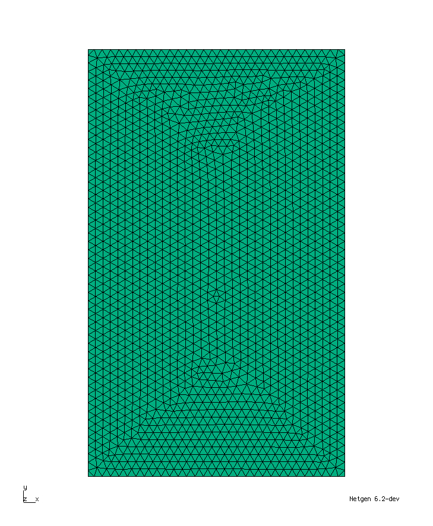
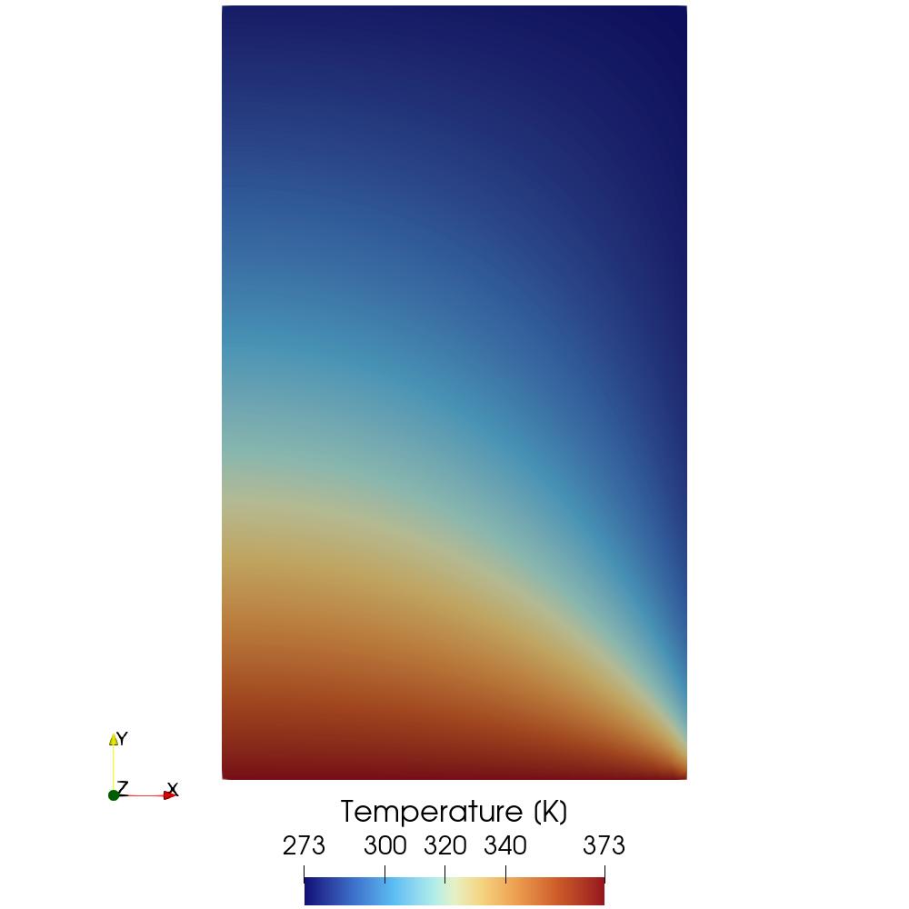
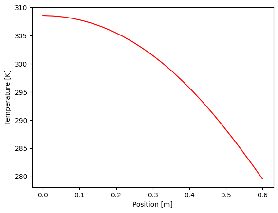

# Cameron 1986: Heat Transfer With Convection

## Introduction

This test case reproduces the NAFEMS benchmark T4 [[1]](#references).
It considers steady-state heat transfer in a rectangular domain of uniform
thickness with mixed boundary conditions: prescribed temperature, adiabatic,
and convective.
The objective is to verify the temperature at a specified location.

<figure style="text-align: center;">
    
    
    
    <figcaption style="width: 75%; margin: 0 auto; text-align: left;">
        <em>Figure 1</em>: The geometry of the computational domain and the
                           corresponding mesh.
    </figcaption>
</figure>

## Setup

The computational domain is a rectangle of width 0.6 m and height 1 m.
The bottom edge is held at a prescribed temperature of $100^\circ$ C (modeled by
[TemperatureCondition](https://raiden-numerics.github.io/mufem-doc/models/thermal/solid_temperature/conditions/temperature.html)).
The left edge is adiabatic (modeled by
[AdiabaticBoundaryCondition](https://raiden-numerics.github.io/mufem-doc/models/thermal/solid_temperature/conditions/adiabatic.html)).
The top and right edges are subject to convection to an ambient temperature of
$0^\circ$ C with a surface heat transfer coefficient
$\kappa = 750$ W/($\text{m}^2$ K) (modeled by
[ConvectionBoundaryCondition](https://raiden-numerics.github.io/mufem-doc/models/thermal/solid_temperature/conditions/convection.html)).
No internal heat generation is present.

## Results

**Temperature**

The temperature is evaluated at a point on the right edge, located 0.2 m above
the bottom edge.
The expected value of $18.3^\circ$ C ($291.45$ K) is reproduced.

The figure below shows the temperature distribution over the computational
domain.

The next figure presents the temperature profile along the x-axis at a fixed
height of $y = 0.5$ m.

## References

[1] A. D. Cameron, J. A. Casey, and G. B. Simpson,
    "Benchmark Tests for Thermal Analysis (Summary)", NAFEMS (1986) \
[2] [Quanscient Allsolve Docs: Steady state heat transfer in solid materials - NAFEMS Benchmark](
    https://allsolve.quanscient.com/documentation/guides/step-by-step-tutorials/tutorial-nafems2dheattransfer)
